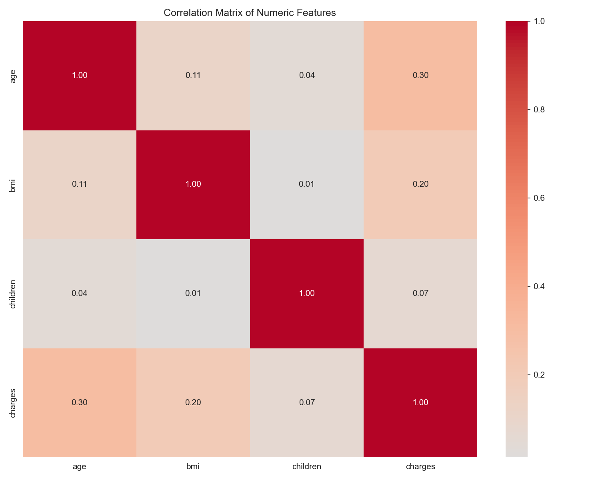
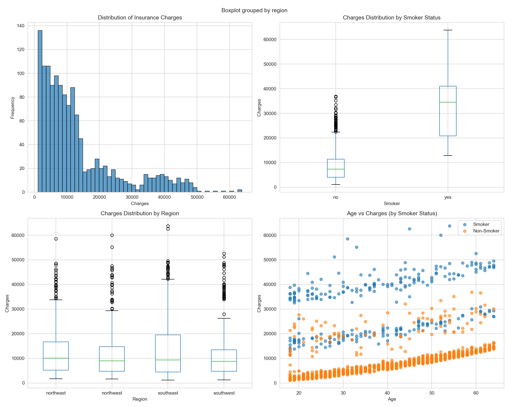
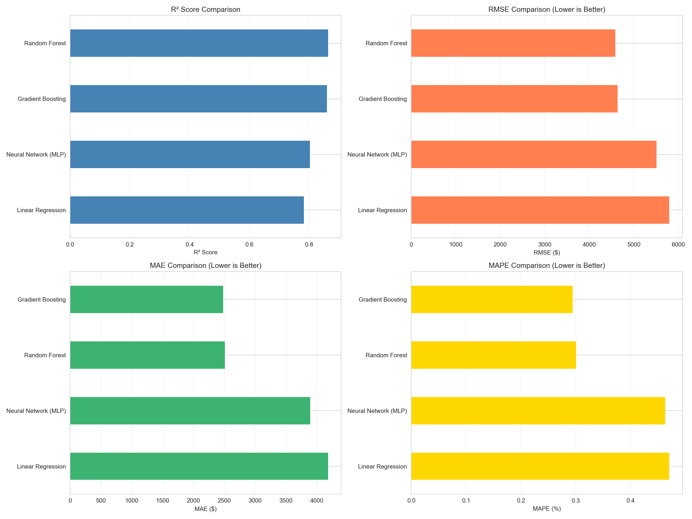
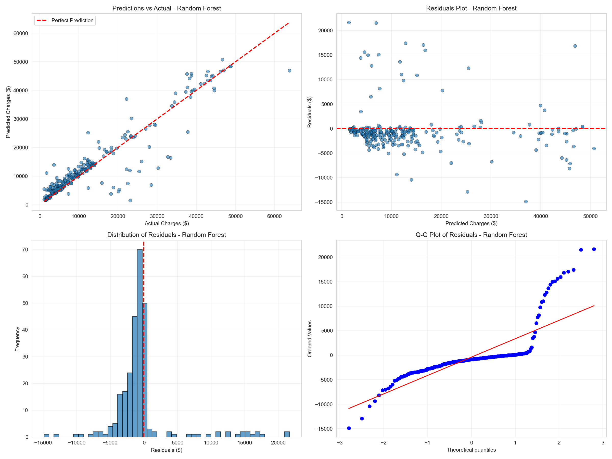
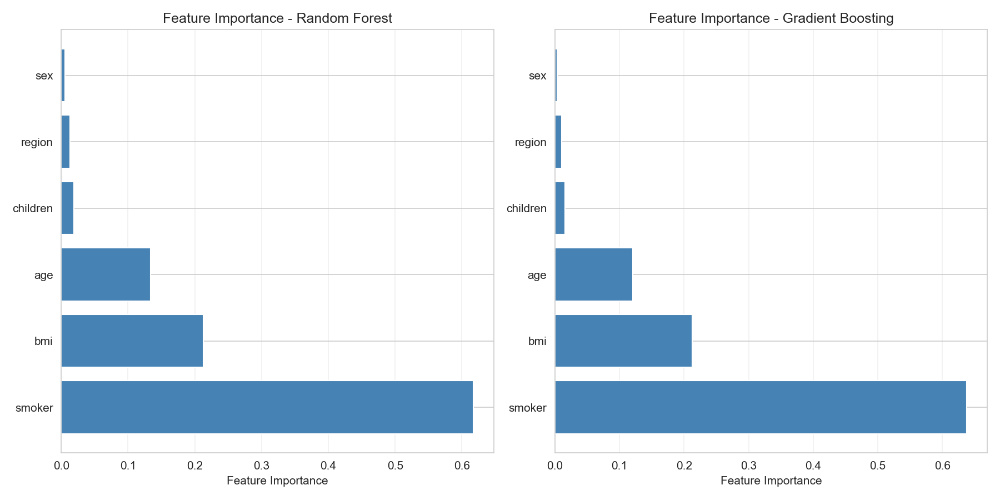

<script id="MathJax-script" async src="https://cdn.jsdelivr.net/npm/mathjax@3/es5/tex-mml-chtml.js"></script>

## Project Overview

In this project, I applied various ML techniques to demonstrate the Atmospheric and Oceanic Studies C111 course at UCLA, to study the impacts of both demographic factors and lifestyle choices on an individual's lifetime medical charges.


***

## Introduction 

Health care costs have risen dramatically over the past few decades, making it more important than ever for both policy issuers and insurance providers to understand the key contributors, as well as overall emerging trends. Specifically, the goal of this project is to provide a predictive framework that, when given demographic and lifestyle characteristics about an individual, can give a reasonable estimate of their lifetime insurance cost. In this project, I used a dataset publicly available from Kaggle, which considered the following attributes: age, sex, bmi, #of children, smoker, region when predicting the target variable charges( individual medical insurance costs in USD). This setup naturally caused me to pursue a supervised ml regression problem, where the target became the continuous variable charges. I sampled several regression approaches: Linear regression, Random Forest, Gradient Boosting, and even a Neural Network(MLP). These approaches were then evaluated on common ML metrics such as (R^2), mean absolute error(MAE), root mean squared error(RSME), and mean absolute percentage error(MAPE).

Through these experiments, my final conclusion was that the Random Forest approach performed the best, and offered the best predictive abilities for the problem statement out of any of the approaches. Furthermore, the key contributors were concluded as smoker status, BMI, and age, with smoking being the clear leading cause. 

## Data Specifications

Title: “Medical Cost Personal Datasets” insurance dataset on Kaggle

Columns:<br>
	age - age of the insurance beneficiary(years)<br>
	Sex - male or female <br>
	cmi- body mass index<br>
	children- number of dependants that are covered by insurance<br>
	smoker- yes/no indication for smoking status<br>
	region: residential region, northeast, southeast, southwest, northwest<br>
	charges: individual medical costs billed by health insurance(USD)<br>

When performing an initial analysis of the data, I computed the following statistics:<br>


Number of samples: 1,338 <br>
Features: age, sex, bmi, children, smoker, region <br>
Target: charges <br>
Average charges: $13,270.42 <br>
Standard deviation of charges: $12,110.01 <br>
Minimum charges: $1,121.87 <br>
Maximum charges: $63,770.43 <br>

Before modeling, I performed the following preprocessing scripts:

```python
def preprocess_data(df):
        df_processed = df.copy()
    categorical_cols = ["sex", "smoker", "region"]
    label_encoders = {}
    
    for col in categorical_cols:
        le = LabelEncoder()
        df_processed[col] = le.fit_transform(df_processed[col])
        label_encoders[col] = le
    
    X = df_processed.drop("charges", axis=1).values
    y = df_processed["charges"].values
    
    X_train, X_test, y_train, y_test = train_test_split(
        X, y, test_size=0.2, random_state=42
    )
    
    scaler = StandardScaler()
    X_train = scaler.fit_transform(X_train)
    X_test = scaler.transform(X_test)
    
    return X_train, X_test, y_train, y_test


```


1. Categorical encoding: for the non numerical datatypes(specifically sex, smoker and region, these were encoded using the Label Encoder) <br>

2. Train-test split: Split dataset into train and test datasets with 80/20 ratio, using train_test_split and a fixed random_state = 42 <br>

3. Used StandardScaler for input features<br>
In the beginning of this project, I had not completed this preprocessing script and doign so was causiing major issues. To be specific, numerical features such as BMI and age 	were on severly different scales, preventing effective training for the MLP and linear regression models. The MLP's loss would fluctatuate severely because due to the large-scale features dominating the gradients. Once such scaling was applied to the preprocessing, this no longer remained an issue, and the MLP model was able to converge properly.


I then also performed further exploratory data analysis to visualize the relationships within my dataset in a clearer fashion.
<figure>
  
  <figcaption>Figure 1: Correlation heatmap of numeric features.</figcaption>
</figure>


<figure>
  
  <figcaption>Figure 2: EDA panels showing charges distribution, smoker/region boxplots, and age vs. charges by smoking status.</figcaption>
</figure>

From the correlation analysis saved in analysis_report.txt, the absolute correlations with charges were: <br>
age: 0.2990 <br>
bmi: 0.1983 <br>
children: 0.0680 <br>

Additionally, I compared average charges for smokers and non-smokers:<br>

Average charges for smokers: $32,050.23 <br>
Average charges for non-smokers: $8,434.27<br>
Difference: $23,615.96 (about 280% higher for smokers)<br>

My rationale for trying to examine the smoker non-smoker relation before performing the ML analysis was based on my precursory knowledge going into this project. Furthermore, I wanted to meaure the pure linear correlations that exist between diffrent variables, and thus I did so for the numeric componenets such as age, bmi and children. However, for smoking since it is a binary yes no, I had to do my precursory analysis in a slighly differnet manner, using the heatmaps. Even before starting the actual ML analysis, we can see that there are strong indicators that smoking, age, bmi should be some of our most important variables.


## Modeling Specifications


Supervised regression task<br>
Given feature vector(x) describing person, predict continuous outcome(y):<br>

Models Used:<br>
Linear Regression<br>
Random Forest <br>
Gradient Boosting<br>
Neural Networks(MLP)<br>


```python
from sklearn.linear_model import LinearRegression
from sklearn.ensemble import RandomForestRegressor, GradientBoostingRegressor
from sklearn.neural_network import MLPRegressor

models = {
    "Linear Regression": LinearRegression(),
    "Random Forest": RandomForestRegressor(
        n_estimators=100, random_state=42, max_depth=10
    ),
    "Gradient Boosting": GradientBoostingRegressor(
        n_estimators=100, random_state=42, max_depth=5
    ),
    "Neural Network (MLP)": MLPRegressor(
        hidden_layer_sizes=(100, 50),
        max_iter=500,
        random_state=42,
        early_stopping=True,
        validation_fraction=0.1,
    ),
}

for name, model in models.items():
    model.fit(X_train, y_train)

```
Evaluation Metrics:<br>
Coefficient of determination(R^2)<br>
Mean Absolute Error(MAE)<br>
Root Mean Squared Error(RMSE)<br>
Mean Absolute Percentage Error(MAPE)<br>


Data Results and Analysis<br>:

Random Forest<br>
(R^2 = 0.8645)<br>
MAE = $2,517.11<br>
RMSE = $4,586.63<br>
MAPE = 30.11%<br>

<br>


Gradient Boosting<br>
(R^2 = 0.8612)<br>
MAE = $2,485.65<br>
RMSE = $4,642.81<br>
MAPE = 29.50%<br>

<br>

Neural Network (MLP)<br>
(R^2 = 0.8040)<br>
MAE = $3,898.93<br>
RMSE = $5,515.77<br>
MAPE = 46.38%<br>

<br>
Linear Regression<br>
(R^2 = 0.7833)<br>
MAE = $4,186.51<br>
RMSE = $5,799.59<br>
MAPE = 47.09%<br>


From these results, we can see the non-linear models are all outperforming the linear regression, across all metrics that we are tracking. The most promising results are from the random forest approach, giving us a strong R^2 metric of 0.8645, as well as the lowest RMSE. It is important to note however, that Gradient Boosting did have a lower MAPE and a lower MAE, thus making gradient boosting and random forest the two winners. <br>

Exploring the random forest further however I was curious to better understand its rationale, so I examined its ranked feature importances.<br>

smoker: 0.6168<br>
bmi: 0.2124<br>
age: 0.1334<br>
children: 0.0187<br>
region: 0.0127<br>
sex: 0.0059<br>

Furthermore here is also the plot that demonstrates how the predicted vs.actual charges are scattered for the random forest approach. From visual inspection it becomes clear that the model is indeed tracking actual values at a reasonably high level. Furthermore, we can see that residuals are centered around zero, and the major errors occur when the cost is being predicted is for abnormally high-cost individuals.

<figure>
  
  <figcaption>Side-by-side comparison of R², RMSE, MAE, and MAPE across all models.</figcaption>
</figure>

<figure>
  
  <figcaption>Predicted vs. actual plus residual diagnostics (Random Forest).</figcaption>
</figure>

<figure>
  
  <figcaption>Feature importance for the tree-based models, highlighting top drivers of insurance charges.</figcaption>
</figure>


Takeaways:<br>

Tree-based ensemble methods outperform the linear regression and MLP configurations. Best model achieves as R^2 of 0.8645, meaning it can capture meaningful signal at a fairly high rate, but a MAPE of 30% demonstrates clear prediction possibilities, especially for individuals with very high charges.<br>
Smoking across the board is the most important feature( .62 importance in random forest approach) in the ML analysis. This is also demonstrated when isolating for smokers versus no smokers, an average of $32k to $8.4k respectively. <br>
BMI,  age come after smoking in terms of factor importance, .21 and .13 respectively. High BMI old age can clearly be argued to contribute to higher charges within insurance.
Children, region, sex are contributing relatively little, at least in the limited analysis we have conducted in this project.<br>

Limitations:<br>

Size of this dataset is somewhat limited(only 1338 samples) thus may not generalize well to other populations<br>
The evaluation is being done using a simple train-test split system. Performing cross-validation, as well as more advanced techniques such as hyperparameter tuning, could boost the performance of the ML approaches we are employing<br>
The preprocessing being doen is quite straightforward, the results would probably improve given more advanced feature engineering(this includes things like non-linear transformations)<br>


